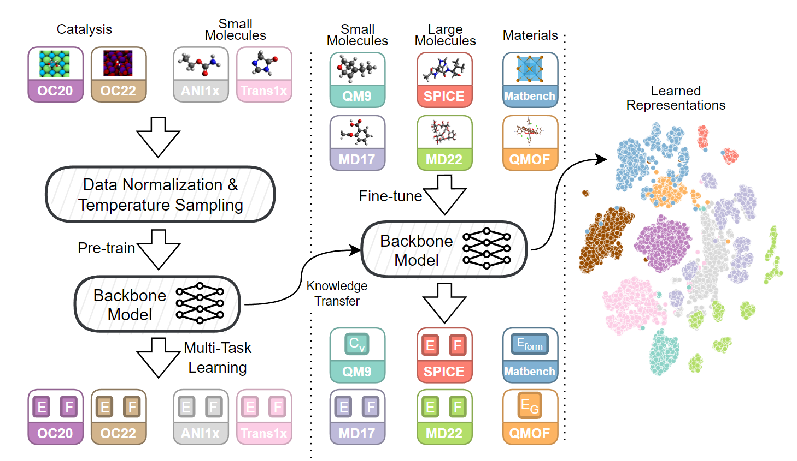
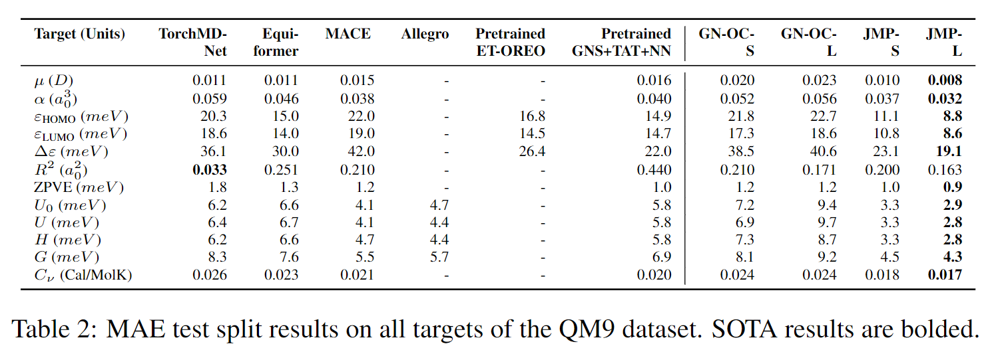
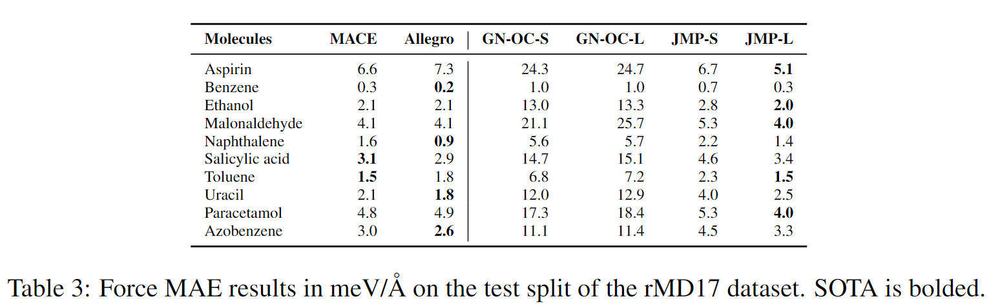
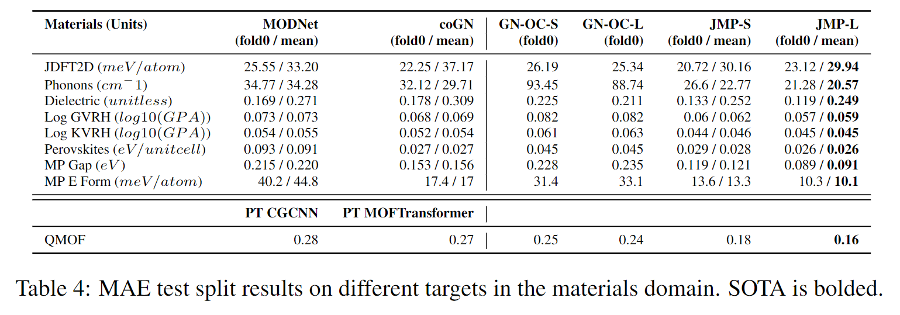
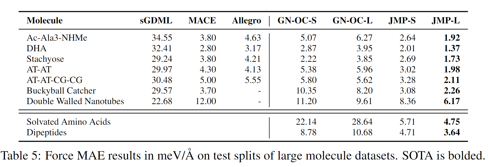

<!-- omit from toc -->
# Joint Multi-domain Pre-Training (JMP)

Please see our [website](https://nima.sh/jmp) for more information about this work.

This repository contains the code for the paper ["From Molecules to Materials: Pre-training Large Generalizable Models for Atomic Property Prediction"](https://openreview.net/forum?id=PfPnugdxup).

<small>

This repository is deprecated and is no longer actively maintained. We are currently working on integrating the functionality of this repository into the official [Open Catalyst Project repository](https://github.com/Open-Catalyst-Project/ocp/).
If you have any questions or concerns with respect to this repository, please feel free to create a github issue or reach out to us via email. Please send an email to [Nima Shoghi](mailto:ns@nima.sh) and CC [Brandon Wood](mailto:bmwood@meta.com).

</small>

<!-- omit from toc -->
## Table of Contents
- [Overview](#overview)
- [Results](#results)
  - [Small Molecule Datasets: QM9 and rmD17](#small-molecule-datasets-qm9-and-rmd17)
  - [Materials Datasets: MatBench and QMOF](#materials-datasets-matbench-and-qmof)
  - [Large Molecule Datasets: MD22 and SPICE](#large-molecule-datasets-md22-and-spice)
- [Installation](#installation)
- [Datasets](#datasets)
  - [Pre-training Datasets](#pre-training-datasets)
    - [ANI-1x Dataset](#ani-1x-dataset)
    - [Transition-1x Dataset](#transition-1x-dataset)
  - [Fine-tuning Datasets](#fine-tuning-datasets)
- [Pre-trained Checkpoints](#pre-trained-checkpoints)
- [Training Models](#training-models)
- [License](#license)
- [Citation](#citation)


## Overview



In this work, we introduce Joint Multi-domain Pre-training (JMP), a supervised pre-training strategy that simultaneously trains on multiple datasets from different chemical domains, treating each dataset as a unique pre-training task within a multi-task framework. Our combined training dataset consists of ~120M systems from OC20, OC22, ANI-1x, and Transition-1x.

The key contributions of this work are:

1. We demonstrate JMP's powerful generalization ability by evaluating its fine-tuning performance across a diverse benchmark suite spanning small molecules, large molecules, and materials. JMP consistently outperforms training from scratch and sets or matches the state-of-the-art on 34 out of 40 fine-tuning benchmarks.

2. We show that JMP enables efficient scaling to larger models that would normally overfit if trained from scratch on small datasets. Pre-training acts as a strong regularizer, allowing us to train a model with 235M parameters that sets new state-of-the-art performance on multiple low-data benchmarks.

3. We conduct a detailed analysis of JMP's computational requirements. While expensive upfront, we show JMP's pre-training cost is recovered by enabling over 12x faster fine-tuning compared to training from scratch.

By pre-training large models on diverse chemical data, we believe JMP represents an important step towards the goal of a universal ML potential for chemistry. The continued growth of available data and compute power will only improve JMP's ability to learn transferable atomic representations.

## Results

JMP demonstrates an average improvement of 59% over training from scratch, and matches or sets state-of-the-art on 34 out of 40 tasks. Our work highlights the potential of pre-training strategies that utilize diverse data to advance property prediction across chemical domains, especially for low-data tasks.

### Small Molecule Datasets: QM9 and rmD17




### Materials Datasets: MatBench and QMOF


### Large Molecule Datasets: MD22 and SPICE


## Installation

First, clone the repository and navigate to the root directory:

```bash
git clone https://github.com/facebookresearch/JMP.git
cd JMP
```

Then, set up the conda environment, as provided in the `environment.yml` file. To do so, run the following command (NOTE: replace `conda` with `mamba` if you have it installed):

```bash
conda env create -f environment.yml -n jmp
```

If the above command fails, you can create the environment manually yourself:

```bash
# Create the environment
conda create -n jmp python=3.11
conda activate jmp

# Install PyTorch
conda install -y -c pytorch -c nvidia pytorch torchvision torchaudio pytorch-cuda=12.1

# Install PyG, PyTorch Scatter, PyTorch Sparse.
conda install -c pyg pyg pytorch-sparse pytorch-cluster

# Install other conda dependencies
conda install -y \
    -c conda-forge \
    numpy matplotlib seaborn sympy pandas numba scikit-learn plotly nbformat ipykernel ipywidgets tqdm pyyaml networkx \
    pytorch-lightning torchmetrics lightning \
    einops wandb \
    cloudpickle \
    "pydantic>2" \
    frozendict wrapt varname typing-extensions lovely-tensors lovely-numpy requests pytest nbval

# Install pip dependencies
pip install lmdb

# Install dependencies for materials datasets
pip install ase

# Install dependencies for large molecule datasets
conda install h5py

# Install MatBench dependencies
pip install matbench

# Install dependencies for PDBBind
pip install biopython rdkit

# Install dependencies for pre-processing ANI1x/Transition1x
pip install multiprocess
```

Then, activate the environment:

```bash
conda activate jmp
```

Finally, install the current package as follows:

```bash
pip install -e .
```

The code is now ready to be used. See the configuration files in the `configs` directory for examples on how to run the code.

## Datasets

The data used for pre-training and fine-tuning is not included in this repository due to size constraints. However, instructions for downloading and preprocessing the OC20, OC22, ANI-1x, Transition-1x, QM9, rMD17, MatBench, QMOF, SPICE, and MD22 datasets are provided below.

### Pre-training Datasets

- For OC20 and OC22, please refer to the [Open Catalyst Project dataset instructions](https://github.com/Open-Catalyst-Project/ocp/blob/main/DATASET.md).
- For ANI-1x, refer to the "ANI-1x Dataset" section below.
- For Transition-1x, refer to the "Transition-1x Dataset" section below.

#### ANI-1x Dataset

To download the ANI-1x dataset and convert it to a format that can be used by our codebase, please follow these steps:

1. Create a directory to store the ANI-1x dataset and navigate to it:

```bash
mkdir -p /path/to/datasets/ani1x
cd /path/to/datasets/ani1x
```

2. Download the ANI-1x dataset (in `.h5` format) from the [official source](https://springernature.figshare.com/ndownloader/files/18112775):

```bash
wget https://springernature.figshare.com/ndownloader/files/18112775 -O ani1x-release.h5
```

3. Compute the train, validation, and test splits:

```bash
python -m jmp.datasets.scripts.ani1x_preprocess.ani1x_splits --input_file ani1x-release.h5 --train_keys_output train_keys.pkl --val_keys_output val_keys.pkl --test_keys_output test_keys.pkl
```

4. Convert the h5 file to a set of `.traj` files (set `--num_workers` to the number of CPU cores you have available):

```bash
mkdir -p traj
mkdir -p traj/train traj/val traj/test
python -m jmp.datasets.scripts.ani1x_preprocess.ani1x_write_traj --ani1x_h5 ani1x-release.h5 --split_keys train_keys.pkl --split train --traj_dir traj/train --num_workers 32
python -m jmp.datasets.scripts.ani1x_preprocess.ani1x_write_traj --ani1x_h5 ani1x-release.h5 --split_keys val_keys.pkl --split val --traj_dir traj/val --num_workers 32
python -m jmp.datasets.scripts.ani1x_preprocess.ani1x_write_traj --ani1x_h5 ani1x-release.h5 --split_keys test_keys.pkl --split test --traj_dir traj/test --num_workers 32
```

5. Convert the `.traj` files to `.lmdb` files:

```bash
mkdir -p lmdb
mkdir -p lmdb/train lmdb/val lmdb/test
python -m jmp.datasets.scripts.ani1x_preprocess.ani1x_write_lmdbs --data_path traj/train --out_path lmdb/train --split train --num_workers 32
python -m jmp.datasets.scripts.ani1x_preprocess.ani1x_write_lmdbs --data_path traj/val --out_path lmdb/val --split val --num_workers 32
python -m jmp.datasets.scripts.ani1x_preprocess.ani1x_write_lmdbs --data_path traj/test --out_path lmdb/test --split test --num_workers 32
```

6. Compute the linear reference energies:

```bash
python -m jmp.datasets.scripts.ani1x_preprocess.ani1x_linear_ref linref --src lmdb/train --out_path linref.npz
```

7. Compute the mean/std of the energies:

```bash
python -m jmp.datasets.scripts.ani1x_preprocess.ani1x_linear_ref compute_mean_std --src lmdb/train --linref_path linref.npz --out_path mean_std.pkl
```

#### Transition-1x Dataset

To download the Transition-1x dataset and convert it to a format that can be used by our codebase, please follow these steps:

1. Create a directory to store the Transition-1x dataset and navigate to it:

```bash
mkdir -p /path/to/datasets/transition1x
cd /path/to/datasets/transition1x
```

2. Download the Transition-1x dataset (in `.h5` format) from the [official source](https://figshare.com/ndownloader/files/36035789):

```bash
wget https://figshare.com/ndownloader/files/36035789 -O transition1x-release.h5
```

3. Convert the h5 file to a set of `.traj` files (set `--num_workers` to the number of CPU cores you have available):

```bash
mkdir -p traj
mkdir -p traj/train traj/val traj/test
python -m jmp.datasets.scripts.transition1x_preprocess.trans1x_write_traj --transition1x_h5 transition1x-release.h5 --split train --traj_dir traj/train --num_workers 32
python -m jmp.datasets.scripts.transition1x_preprocess.trans1x_write_traj --transition1x_h5 transition1x-release.h5 --split val --traj_dir traj/val --num_workers 32
python -m jmp.datasets.scripts.transition1x_preprocess.trans1x_write_traj --transition1x_h5 transition1x-release.h5 --split test --traj_dir traj/test --num_workers 32
```

4. Convert the `.traj` files to `.lmdb` files:

```bash
mkdir -p lmdb
mkdir -p lmdb/train lmdb/val lmdb/test
python -m jmp.datasets.scripts.transition1x_preprocess.trans1x_write_lmdbs --data_path traj/train --out_path lmdb/train --split train --num_workers 32
python -m jmp.datasets.scripts.transition1x_preprocess.trans1x_write_lmdbs --data_path traj/val --out_path lmdb/val --split val --num_workers 32
python -m jmp.datasets.scripts.transition1x_preprocess.trans1x_write_lmdbs --data_path traj/test --out_path lmdb/test --split test --num_workers 32
```

5. Compute the linear reference energies:

```bash
python -m jmp.datasets.scripts.transition1x_preprocess.trans1x_linear_ref linref --src lmdb/train --out_path linref.npz
```

6. Compute the mean/std of the energies:

```bash
python -m jmp.datasets.scripts.transition1x_preprocess.trans1x_linear_ref compute_mean_std --src lmdb/train --linref_path linref.npz --out_path mean_std.pkl
```

### Fine-tuning Datasets
- For rMD17, please run the following command to download the dataset to your desired directory: `python -m jmp.datasets.finetune.rmd17 download --destination /path/to/datasets/rmd17/`
- For QM9, please run the following command to download the dataset to your desired directory: `python -m jmp.datasets.finetune.qm9 download --destination /path/to/datasets/qm9/`
- For MD22, please run the following command to download the dataset to your desired directory: `python -m jmp.datasets.finetune.md22 download --destination /path/to/datasets/md22/`
- For SPICE, please run the following command to download the dataset to your desired directory: `python -m jmp.datasets.finetune.spice download --destination /path/to/datasets/spice/`
- For MatBench, please run the following command to download the dataset to your desired directory: `python -m jmp.datasets.finetune.mat_bench download --destination /path/to/datasets/matbench/`
- For QMOF, please run the following command to download the dataset to your desired directory: `python -m jmp.datasets.finetune.qmof download --destination /path/to/datasets/qmof/`

## Pre-trained Checkpoints

The pre-trained checkpoints are available for download from the following links:

- [JMP-S](https://jmp-iclr-datasets.s3.amazonaws.com/jmp-s.pt)
- [JMP-L](https://jmp-iclr-datasets.s3.amazonaws.com/jmp-l.pt)

## Training Models

Our codebase is designed to be Python-based. To train a model, you create a configuration file that specifies the model, dataset, and training parameters. These configuration objects are fully type-checked and validated using Pydantic.

Once you have created a configuration object, you can use the `jmp.lightning.Runner` class to wrap the training loop. See `configs/jmp_l_finetune.ipynb` for an example of how to finetune a model.

## License

The majority of JMP is CC-BY-NC licensed, as found in the `LICENSE` file. However, portions of the project are available under separate license terms:

- The ASE library is licensed under the GNU Lesser General Public License v2.1.
- PyTorch Lightning and TorchMetrics are licensed under the Apache License 2.0.
- DeepChem is licensed under the MIT License.
- RDKit is licensed under the BSD 3-Clause License.
- Biopython is licensed under the Biopython License Agreement.
- Pydantic is licensed under the MIT License.
- MatBench is licensed under the MIT License.
- Submitit is licensed under the MIT License.
- Model implementations are based on the Open Catalyst Project and are licensed under the MIT License.
- EMA implementation is based on the NeMo's implementation and is licensed under the Apache License 2.0.

## Citation

If you use this code in your research, please cite the following paper:

```
@article{shoghi2023molecules,
  title={From molecules to materials: Pre-training large generalizable models for atomic property prediction},
  author={Shoghi, Nima and Kolluru, Adeesh and Kitchin, John R and Ulissi, Zachary W and Zitnick, C Lawrence and Wood, Brandon M},
  journal={arXiv preprint arXiv:2310.16802},
  year={2023}
}
```
